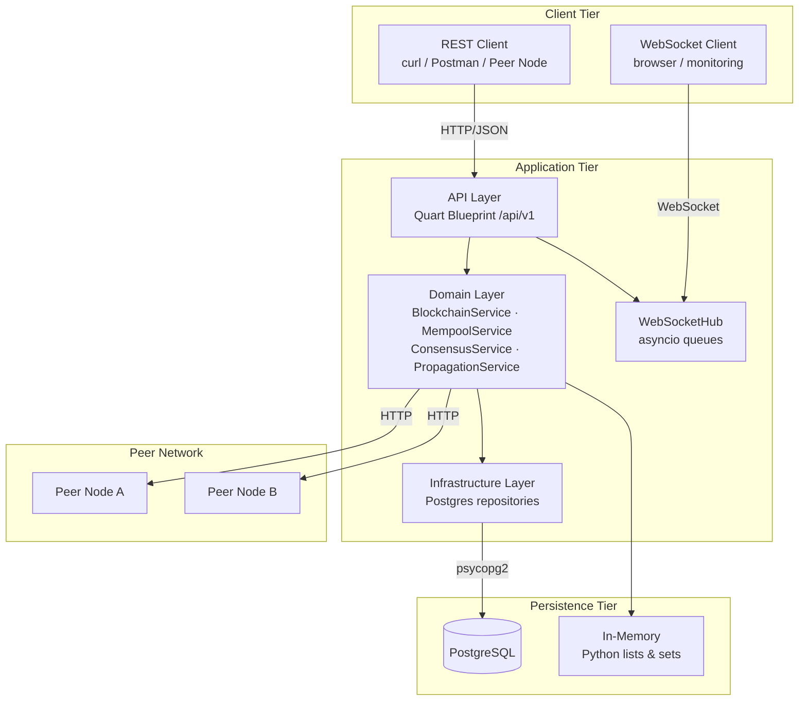
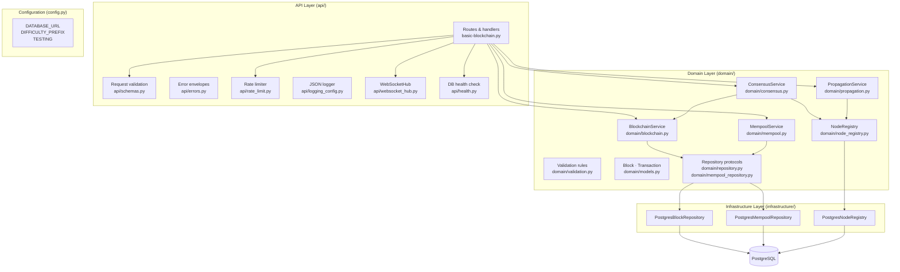
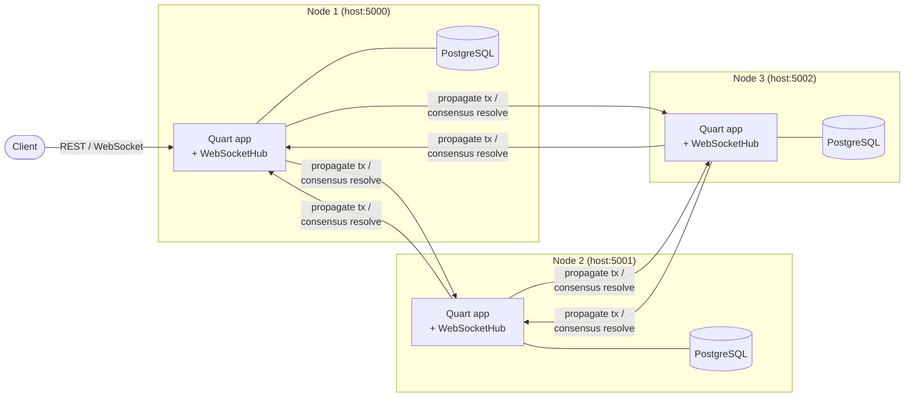
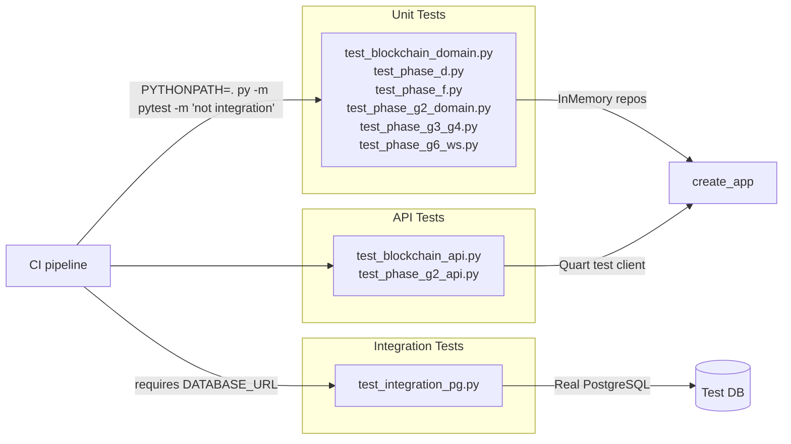

# Architecture — Blockchain Simulator

## 1. Overview

The Blockchain Simulator is a single-node, educational blockchain implementation
built in Python. It exposes a versioned REST API, supports optional PostgreSQL
persistence, propagates transactions and consensus triggers to registered peer
nodes, and pushes real-time block-mined events via WebSocket.

**Technology stack**

| Concern | Technology |
|---------|-----------|
| Language | Python 3.10+ |
| Web framework | Quart 0.19+ (ASGI, async) |
| ASGI runner (prod) | Hypercorn |
| Persistence (optional) | PostgreSQL 14+ via psycopg2-binary |
| Concurrency | asyncio (request handling) + ThreadPoolExecutor (peer HTTP calls) |
| Test runner | pytest 8+ with pytest-asyncio, pytest-cov |
| Environment config | python-dotenv |

---

## 2. High-Level Component Diagram



---

## 3. Layered Architecture



---

## 4. Deployment Diagram



---

## 5. Module Dependency Map

```
basic-blockchain.py
├── config.py
├── api/
│   ├── errors.py          ← Quart
│   ├── health.py          ← psycopg2
│   ├── logging_config.py  ← Quart (g)
│   ├── rate_limit.py      ← Quart (jsonify)
│   ├── schemas.py         ← domain/models.py
│   └── websocket_hub.py   ← asyncio, Quart (websocket)
├── domain/
│   ├── models.py          ← stdlib only
│   ├── validation.py      ← domain/models.py
│   ├── repository.py      ← domain/models.py
│   ├── mempool_repository.py ← domain/models.py
│   ├── node_registry.py   ← stdlib only
│   ├── blockchain.py      ← domain/models.py, domain/repository.py
│   ├── mempool.py         ← domain/mempool_repository.py, domain/validation.py
│   ├── consensus.py       ← domain/blockchain.py, domain/node_registry.py
│   └── propagation.py     ← domain/node_registry.py, domain/models.py
└── infrastructure/
    ├── postgres_repository.py         ← psycopg2, domain/models.py
    ├── postgres_mempool_repository.py ← psycopg2, domain/models.py
    └── postgres_node_registry.py      ← psycopg2, domain/node_registry.py
```

---

## 6. Key Design Decisions

### Repository Pattern
All domain services depend on protocol interfaces (`BlockRepositoryProtocol`,
`MempoolRepositoryProtocol`, `NodeRegistryProtocol`). Concrete implementations
(in-memory vs PostgreSQL) are injected at startup. This makes unit tests run
without a database and allows the persistence backend to be swapped without
touching service code.

### Async-First with sync DB driver
Quart is ASGI-native and all route handlers are `async def`. psycopg2 is
synchronous and runs on the event loop thread — acceptable for a simulator.
For high-throughput production workloads, migrate to `asyncpg`.

### Fire-and-Forget Propagation
`PropagationService` dispatches HTTP calls to peers via `ThreadPoolExecutor`
(up to 8 workers). Errors are silently swallowed; there is no retry or
acknowledgement. This keeps mining latency low at the cost of eventual consistency.

### X-Propagated Loop Prevention
When a node forwards a transaction to its peers it adds `X-Propagated: 1`.
Receiving nodes store the transaction but do not re-forward it, preventing
infinite relay loops in fully-connected topologies.

### Sliding-Window Rate Limiting
The rate limiter is a process-level counter (not distributed). It is intentional
for a single-process educational simulator. In a multi-worker deployment, a
shared store (Redis) would be required.

### Injectable WebSocketHub
`WebSocketHub.serve()` accepts an optional `send_fn` parameter. In production
it defaults to `quart.websocket.send`. In tests, a `fake_send` is injected,
avoiding the need for a real WebSocket context and keeping tests fast and
deterministic.

---

## 7. Configuration Reference

| Variable | Type | Default | Description |
|----------|------|---------|-------------|
| `DATABASE_URL` | `str \| None` | `None` | PostgreSQL DSN. If absent, in-memory mode is used. |
| `DIFFICULTY_PREFIX` | `str` | `"00000"` | Leading zeros required in a valid block hash. Increase for harder mining. |
| `TESTING` | `bool` | `False` | Set to `1` / `true` / `yes` to enable Quart test mode. |

---

## 8. Test Architecture



**Coverage gate:** 80% across `domain/`, `api/`, `infrastructure/`.

---

## 9. Security Considerations (Current Scope)

| Area | Current implementation | Production recommendation |
|------|----------------------|--------------------------|
| Authentication | None | JWT or API-key middleware |
| TLS | None (dev server) | Hypercorn with TLS cert or reverse proxy (nginx) |
| Input validation | Schema + business-rule validation | Add JSON Schema validation library |
| Rate limiting | Process-local sliding window | Distributed rate limiter (Redis + token bucket) |
| URL scheme enforcement | http/https only (propagation, consensus) | Same; add allowlist of peer IPs |
| Logging | Structured JSON | Ship to ELK / Loki; redact sensitive fields |
| DB credentials | Via `DATABASE_URL` env var / `.env` | Secrets manager (Vault, AWS Secrets Manager) |
