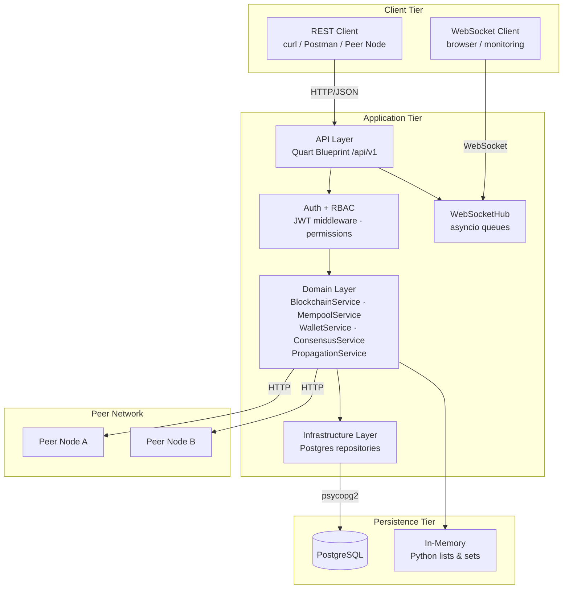
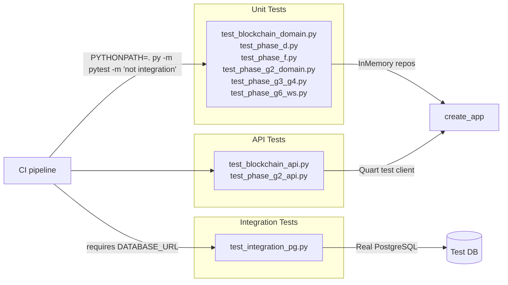

# Architecture — Blockchain Simulator

## 1. Overview

The Blockchain Simulator is a single-node, educational blockchain implementation
built in Python. It exposes a versioned REST API, supports optional PostgreSQL
persistence, propagates transactions and consensus triggers to registered peer
nodes, and pushes real-time block-mined events via WebSocket. Phase I adds
multi-user JWT auth, RBAC with audit logging, per-user wallets (BIP-39 + signed
transfers), and enriched admin controls (soft-delete/restore users, wallet
freeze/unfreeze, profile edits).

**Technology stack**

| Concern | Technology |
|---------|-----------|
| Language | Python 3.11+ |
| Web framework | Quart 0.19+ (ASGI, async) |
| ASGI runner (prod) | Hypercorn |
| Persistence (optional) | PostgreSQL 14+ via psycopg2-binary |
| Auth | JWT (HS256) + bcrypt |
| Concurrency | asyncio (request handling) + ThreadPoolExecutor (peer HTTP calls) |
| Test runner | pytest 8+ with pytest-asyncio, pytest-cov |
| Environment config | python-dotenv |

---

## 2. High-Level Component Diagram



---

## 3. Layered Architecture

```mermaid
graph TD
    subgraph api["API Layer  (api/)"]
        routes["Routes & handlers\nbasic-blockchain.py"]
        authmw["JWT middleware\napi/auth_middleware.py"]
        authroutes["Auth routes\napi/auth_routes.py"]
        adminroutes["Admin routes\napi/admin_routes.py"]
        walletroutes["Wallet routes\napi/wallet_routes.py"]
        schema["Request validation\napi/schemas.py"]
        errors["Error envelopes\napi/errors.py"]
        perms["Permission gate\napi/permissions.py"]
        ratelimit["Rate limiter\napi/rate_limit.py"]
        logging["JSON logger\napi/logging_config.py"]
        hub["WebSocketHub\napi/websocket_hub.py"]
        health["DB health check\napi/health.py"]
    end

    subgraph domain["Domain Layer  (domain/)"]
        auth["JWT + bcrypt\ndomain/auth.py"]
        audit["Audit entries\ndomain/audit.py"]
        permsdom["Permission catalog\ndomain/permissions.py"]
        crypto["BIP-39 + signing\ndomain/crypto.py"]
        bs["BlockchainService\ndomain/blockchain.py"]
        ms["MempoolService\ndomain/mempool.py"]
        cs["ConsensusService\ndomain/consensus.py"]
        ps["PropagationService\ndomain/propagation.py"]
        nr["NodeRegistry\ndomain/node_registry.py"]
        walletsvc["Wallet/Transfer services\ndomain/wallet.py"]
        val["Validation rules\ndomain/validation.py"]
        models["Block · Transaction\ndomain/models.py"]
        protos["Repository protocols\ndomain/repository.py\ndomain/mempool_repository.py"]
        userrepo["User repo protocol\ndomain/user_repository.py"]
        walletrepo["Wallet repo protocol\ndomain/wallet_repository.py"]
    end

    subgraph infra["Infrastructure Layer  (infrastructure/)"]
        pgb["PostgresBlockRepository"]
        pgm["PostgresMempoolRepository"]
        pgn["PostgresNodeRegistry"]
        pgu["PostgresUserStore"]
        pgw["PostgresWalletStore"]
    end

    subgraph config["Configuration  (config.py)"]
        env["DATABASE_URL\nDIFFICULTY_PREFIX\nJWT_SECRET\nJWT_TTL_SECONDS\nBCRYPT_ROUNDS\nTESTING"]
    end

    routes --> authmw
    routes --> authroutes
    routes --> adminroutes
    routes --> walletroutes
    routes --> schema
    routes --> bs
    routes --> ms
    routes --> cs
    routes --> ps
    routes --> hub
    routes --> health
    routes --> perms
    routes --> ratelimit
    bs --> protos
    ms --> protos
    cs --> bs
    cs --> nr
    ps --> nr
    protos --> pgb
    protos --> pgm
    nr --> pgn
    pgb --> db[(PostgreSQL)]
    pgm --> db
    pgn --> db
```



---

## 4. Deployment Diagram


---

## 5. Module Dependency Map

```
basic-blockchain.py
├── config.py
├── api/
│   ├── admin_routes.py    ← Quart, domain/*
│   ├── auth_middleware.py ← Quart, domain/auth.py, domain/permissions.py
│   ├── auth_routes.py     ← Quart, domain/auth.py
│   ├── errors.py          ← Quart
│   ├── health.py          ← psycopg2
│   ├── logging_config.py  ← Quart (g)
│   ├── permissions.py     ← Quart, domain/permissions.py
│   ├── rate_limit.py      ← Quart (jsonify)
│   ├── schemas.py         ← domain/models.py
│   ├── wallet_routes.py   ← Quart, domain/wallet.py
│   └── websocket_hub.py   ← asyncio, Quart (websocket)
├── domain/
│   ├── auth.py            ← bcrypt, jwt
│   ├── audit.py           ← stdlib only
│   ├── permissions.py     ← domain/auth.py
│   ├── crypto.py          ← mnemonic, coincurve
│   ├── wallet.py          ← domain/wallet_repository.py, domain/crypto.py
│   ├── user_repository.py ← stdlib only
│   ├── wallet_repository.py ← stdlib only
│   ├── models.py          ← stdlib only
│   ├── validation.py      ← domain/models.py
│   ├── repository.py      ← domain/models.py
│   ├── mempool_repository.py ← domain/models.py
│   ├── node_registry.py   ← stdlib only
│   ├── blockchain.py      ← domain/models.py, domain/repository.py
│   ├── mempool.py         ← domain/mempool_repository.py, domain/validation.py
│   ├── consensus.py       ← domain/blockchain.py, domain/node_registry.py
│   └── propagation.py     ← domain/node_registry.py, domain/models.py
└── infrastructure/
    ├── postgres_repository.py         ← psycopg2, domain/models.py
    ├── postgres_mempool_repository.py ← psycopg2, domain/models.py
    ├── postgres_node_registry.py      ← psycopg2, domain/node_registry.py
    ├── postgres_user_store.py         ← psycopg2, domain/user_repository.py
    └── postgres_wallet_store.py       ← psycopg2, domain/wallet_repository.py
```

---

## 6. Key Design Decisions

### Repository Pattern
All domain services depend on protocol interfaces (`BlockRepositoryProtocol`,
`MempoolRepositoryProtocol`, `NodeRegistryProtocol`). Concrete implementations
(in-memory vs PostgreSQL) are injected at startup. This makes unit tests run
without a database and allows the persistence backend to be swapped without
touching service code.

### Async-First with sync DB driver
Quart is ASGI-native and all route handlers are `async def`. psycopg2 is
synchronous and runs on the event loop thread — acceptable for a simulator.
For high-throughput production workloads, migrate to `asyncpg`.

### Fire-and-Forget Propagation
`PropagationService` dispatches HTTP calls to peers via `ThreadPoolExecutor`
(up to 8 workers). Errors are silently swallowed; there is no retry or
acknowledgement. This keeps mining latency low at the cost of eventual consistency.

### X-Propagated Loop Prevention
When a node forwards a transaction to its peers it adds `X-Propagated: 1`.
Receiving nodes store the transaction but do not re-forward it, preventing
infinite relay loops in fully-connected topologies.

### Sliding-Window Rate Limiting
The rate limiter is a process-level counter (not distributed). It is intentional
for a single-process educational simulator. In a multi-worker deployment, a
shared store (Redis) would be required.

### Injectable WebSocketHub
`WebSocketHub.serve()` accepts an optional `send_fn` parameter. In production
it defaults to `quart.websocket.send`. In tests, a `fake_send` is injected,
avoiding the need for a real WebSocket context and keeping tests fast and
deterministic.

---

## 7. Configuration Reference

| Variable | Type | Default | Description |
|----------|------|---------|-------------|
| `DATABASE_URL` | `str \| None` | `None` | PostgreSQL DSN. If absent, in-memory mode is used. |
| `DIFFICULTY_PREFIX` | `str` | `"00000"` | Leading zeros required in a valid block hash. Increase for harder mining. |
| `TESTING` | `bool` | `False` | Set to `1` / `true` / `yes` to enable Quart test mode. |
| `JWT_SECRET` | `str` | *(required)* | Secret used to sign JWTs. Required when `TESTING=false`. |
| `JWT_ALGORITHM` | `str` | `"HS256"` | JWT signing algorithm. |
| `JWT_TTL_SECONDS` | `int` | `1800` | JWT expiry in seconds. |
| `BCRYPT_ROUNDS` | `int` | `12` | bcrypt cost factor for password hashing. |
| `BOOTSTRAP_ADMIN_USERNAME` | `str \| None` | `None` | Username to auto-promote to ADMIN for the first user. |

---

## 8. Test Architecture



**Coverage gate:** 80% across `domain/`, `api/`, `infrastructure/`.

---

## 9. Security Considerations (Current Scope)

| Area | Current implementation | Production recommendation |
|------|----------------------|--------------------------|
| Authentication | JWT (HS256) + RBAC + audit log | Add token rotation and short-lived refresh tokens |
| TLS | None (dev server) | Hypercorn with TLS cert or reverse proxy (nginx) |
| Input validation | Schema + business-rule validation | Add JSON Schema validation library |
| Rate limiting | Process-local sliding window | Distributed rate limiter (Redis + token bucket) |
| URL scheme enforcement | http/https only (propagation, consensus) | Same; add allowlist of peer IPs |
| Logging | Structured JSON | Ship to ELK / Loki; redact sensitive fields |
| Secrets | `JWT_SECRET` and `DATABASE_URL` via env var / `.env` | Secrets manager (Vault, AWS Secrets Manager) |

---

## 10. Frontend companion

The companion SPA is `basic-blockchain-frontend` (Vue 3 + Pinia + PrimeVue).

### Phase 5 UI architecture

```
src/
  assets/
    main.css          — global utility classes (modal, flow, table, badge system)
    design-system.css — Cadena design tokens
  components/
    atoms/            — Stepper, StatusBadge, HashChip, AmountDisplay
    molecules/        — BlockCard, TransactionRow, NodeBadge, MetricTile
    organisms/        — ChainList, MempoolTable, NodePanel, MineButton…
    flows/            — Multi-step modal components (MineBlockFlow,
                        TransactionDetailFlow, SendConfirmFlow, ReceiveFlow,
                        WithdrawFlow, ConvertFlow, ExchangeOrderFlow,
                        P2PBuyFlow, TreasuryApprovalFlow, KYCReviewFlow,
                        DisputeResolutionFlow)
    drawers/          — UserDrawer (5-tab slide-in panel)
    modals/           — ConfirmUserModal
  views/              — Route-level components
    Admin*            — Admin management views (Users, Wallets, Currencies,
                        ExchangeRates, Compliance, Treasury)
    Chain/Mempool/Nodes — Blockchain explorer views with bigstat rows
    P2PView/ExchangeView — User-facing market views
    WalletView        — Portfolio + quick actions
```

### API surface consumed by Phase 5 frontend

| Frontend feature        | Endpoint                                       | Status         |
| ----------------------- | ---------------------------------------------- | -------------- |
| Mine block              | `POST /api/v1/mine_block`                      | implemented    |
| View chain              | `GET /api/v1/chain`                            | implemented    |
| Pending mempool         | `GET /api/v1/mempool`                          | implemented    |
| Submit transaction      | `POST /api/v1/transactions`                    | implemented    |
| Confirmed transactions  | `GET /api/v1/transactions`                     | implemented    |
| Admin users             | `GET/PATCH /api/v1/admin/users`                | implemented    |
| Admin wallets           | `GET /api/v1/admin/wallets`                    | implemented    |
| Currencies              | `GET/POST /api/v1/admin/currencies`            | implemented    |
| Exchange rates          | `GET/POST /api/v1/admin/rates`                 | implemented    |
| Nodes / consensus       | `GET/POST /api/v1/nodes`                       | implemented    |
| Treasury distribute     | `POST /api/v1/treasury/distribute`             | pending        |
| Treasury approve        | `POST /api/v1/treasury/distribute/:id/approve` | pending        |
| Treasury wallets list   | `GET /api/v1/treasury/wallets`                 | pending        |
| Audit log               | `GET /api/v1/audit`                            | pending        |
| P2P endpoints           | `GET/POST /api/v1/p2p/offers`                  | pending        |
