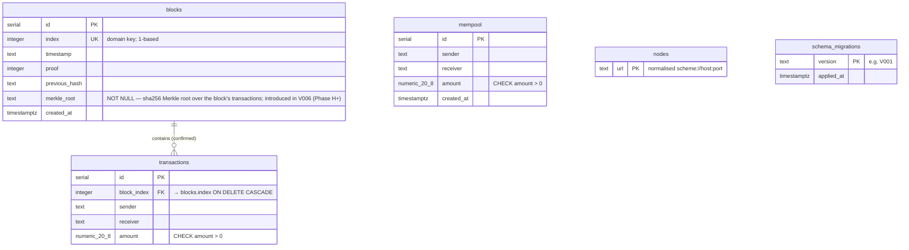
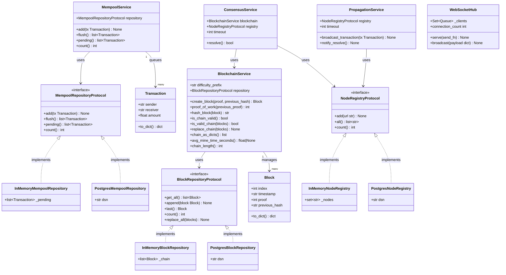

# Data Model — Blockchain Simulator

## 1. Domain Model (Python)

### Block

```python
@dataclass
class Block:
    index:         int               # 1-based chain position; auto-incremented
    timestamp:     str               # ISO-8601 datetime (UTC)
    proof:         int               # Proof-of-Work result satisfying difficulty
    previous_hash: str               # SHA-256 hash of the preceding block (hex)
                                     # Genesis uses "0" as sentinel
    merkle_root:   str               # SHA-256 Merkle root over `transactions`
                                     # Empty list -> sha256("").hexdigest()
    transactions:  list[Transaction] # Confirmed in this block; hydrated at
                                     # read time from the `transactions` table
```

`merkle_root` and `transactions` were added in v0.10.0 (Phase H+). The
chain hash covers `merkle_root`, so any post-hoc edit to a confirmed
transaction makes `is_chain_valid()` return `False`.

### Transaction

```python
@dataclass
class Transaction:
    sender:   str    # Non-empty account identifier
    receiver: str    # Non-empty account identifier; must differ from sender
    amount:   float  # Positive numeric value; stored as NUMERIC(20,8) in DB
```

---

## 2. Entity-Relationship Diagram (PostgreSQL)



---

## 3. Logical Data Model



---

## 4. Database Schema (DDL)

### V001 — Migration tracking

```sql
CREATE TABLE schema_migrations (
    version    TEXT        PRIMARY KEY,
    applied_at TIMESTAMPTZ DEFAULT NOW() NOT NULL
);
```

### V002 — Block storage

```sql
CREATE TABLE blocks (
    id            SERIAL      PRIMARY KEY,
    index         INTEGER     UNIQUE NOT NULL,
    timestamp     TEXT        NOT NULL,
    proof         INTEGER     NOT NULL,
    previous_hash TEXT        NOT NULL,
    created_at    TIMESTAMPTZ DEFAULT NOW()
);
CREATE INDEX idx_blocks_index ON blocks (index);
```

### V003 — Mempool (pending transactions)

```sql
CREATE TABLE mempool (
    id         SERIAL          PRIMARY KEY,
    sender     TEXT            NOT NULL,
    receiver   TEXT            NOT NULL,
    amount     NUMERIC(20, 8)  NOT NULL CHECK (amount > 0),
    created_at TIMESTAMPTZ     DEFAULT NOW()
);
CREATE INDEX idx_mempool_created_at ON mempool (created_at);
```

### V004 — Confirmed transactions

```sql
CREATE TABLE transactions (
    id          SERIAL          PRIMARY KEY,
    block_index INTEGER         NOT NULL REFERENCES blocks (index) ON DELETE CASCADE,
    sender      TEXT            NOT NULL,
    receiver    TEXT            NOT NULL,
    amount      NUMERIC(20, 8)  NOT NULL CHECK (amount > 0)
);
CREATE INDEX idx_transactions_block_index ON transactions (block_index);
CREATE INDEX idx_transactions_sender      ON transactions (sender);
CREATE INDEX idx_transactions_receiver    ON transactions (receiver);
```

### V005 — Peer node registry

```sql
CREATE TABLE nodes (
    url TEXT PRIMARY KEY
);
```

---

## 5. Persistence Mode Comparison

| Concern | In-Memory | PostgreSQL |
|---------|-----------|------------|
| Setup | None (default) | `DATABASE_URL` env var + `migrate.py` |
| Data survival on restart | Lost | Preserved |
| Genesis block | Re-created on every start | Created once; detected via `count() > 0` |
| Mempool flush atomicity | In-process list swap | Single DB transaction |
| Used in | Unit tests, local dev | Staging, production |
| Swap mechanism | Inject alternate `BlockRepositoryProtocol` implementation | Same interface, different constructor |
