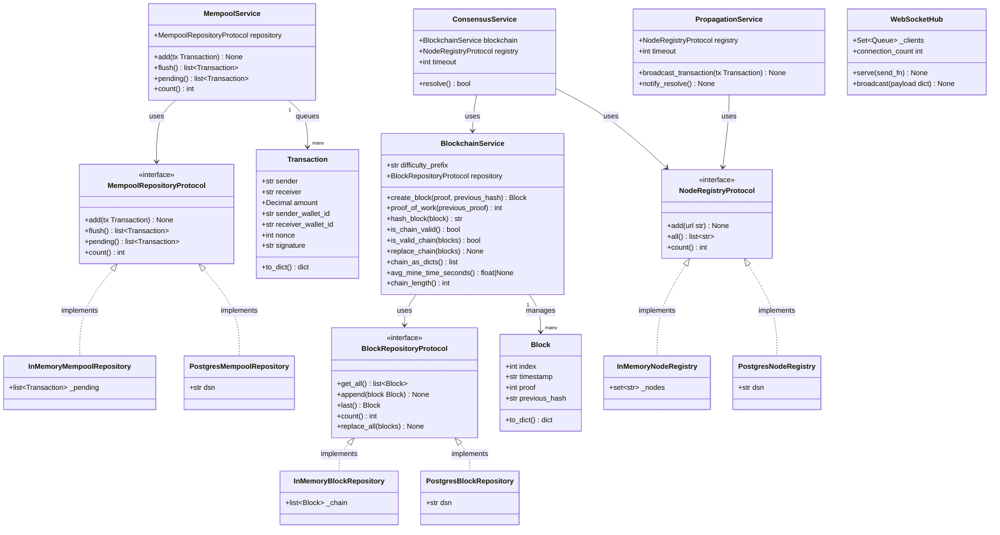

# Data Model — Blockchain Simulator

## 1. Domain Model (Python)

### User identity (Phase I.1, v0.11.0)

```python
class Role(str, Enum):
    ADMIN = "ADMIN"; OPERATOR = "OPERATOR"; VIEWER = "VIEWER"

@dataclass
class UserRecord:
    user_id:      str   # 32-hex opaque server-generated id
    username:     str   # unique handle, login subject
    display_name: str
    email:        str | None
    banned:       bool
    deleted_at:   str | None
    # Phase 5b — enriched profile columns (V018)
    country:      str | None    # ISO-3166 alpha-2
    kyc_level:    str           # 'L0' | 'L1' | 'L2' | 'L3' (default 'L0')
    last_active:  str | None    # ISO 8601 UTC
    created_at:   str | None    # ISO 8601 UTC
    # Phase 6g — KYC user flow (V019)
    kyc_documents:       dict[str, dict[str, object]]  # keyed by doc type
    kyc_pending_review:  str | None    # target level under review, e.g. 'L1'
    kyc_submitted_at:    str | None    # ISO 8601 UTC

@dataclass
class CredentialsRecord:
    user_id:              str
    password_hash:        str   # bcrypt; empty until activated
    activation_code:      str | None
    activated_at:         str | None
    must_change_password: bool
```

JWT payload (HS256, default 30-min TTL):

```python
@dataclass(frozen=True)
class JWTPayload:
    sub:   str        # users.user_id
    roles: list[str]  # ['ADMIN', 'OPERATOR', 'VIEWER'] subset
    iat:   int
    exp:   int
```

### Wallet (Phase I.3, v0.13.0)

```python
@dataclass
class WalletRecord:
    wallet_id:  str          # 'w_' + 16 hex chars (server-generated)
    user_id:    str          # FK to users.user_id
    currency:   str          # 'NATIVE' until Phase J
    balance:    Decimal      # NUMERIC(28,8); changes only when a block is mined
    public_key: str          # 33-byte secp256k1 compressed hex
    frozen:     bool         # ADMIN can flip via /admin/wallets/<id>/freeze
```

Mnemonic-side state lives **only** in the response of
`POST /api/v1/wallets`. The server sees the seed bytes during keypair
derivation and discards them; nothing about the mnemonic is logged or
persisted.

### Block

```python
@dataclass
class Block:
    index:         int               # 1-based chain position; auto-incremented
    timestamp:     str               # ISO-8601 datetime (UTC)
    proof:         int               # Proof-of-Work result satisfying difficulty
    previous_hash: str               # SHA-256 hash of the preceding block (hex)
                                     # Genesis uses "0" as sentinel
    merkle_root:   str               # SHA-256 Merkle root over `transactions`
                                     # Empty list -> sha256("").hexdigest()
    transactions:  list[Transaction] # Confirmed in this block; hydrated at
                                     # read time from the `transactions` table
```

`merkle_root` and `transactions` were added in v0.10.0 (Phase H+). The
chain hash covers `merkle_root`, so any post-hoc edit to a confirmed
transaction makes `is_chain_valid()` return `False`.

### Transaction

```python
@dataclass
class Transaction:
    sender:   str    # Non-empty account identifier
    receiver: str    # Non-empty account identifier; must differ from sender
    amount:   Decimal  # Positive numeric value; stored as NUMERIC(20,8) in DB
    sender_wallet_id: str  # Wallet ID for signed transfers (Phase I.3)
    receiver_wallet_id: str
    nonce: int
    signature: str
```

---

## 2. Entity-Relationship Diagram (PostgreSQL)

```mermaid
erDiagram
    blocks {
        serial      id              PK
        integer     index           UK  "domain key; 1-based"
        text        timestamp
        integer     proof
        text        previous_hash
        text        merkle_root         "NOT NULL — sha256 Merkle root over the block's transactions; introduced in V006 (Phase H+)"
        timestamptz created_at
    }

    transactions {
        serial          id          PK
        integer         block_index FK  "→ blocks.index ON DELETE CASCADE"
        text            sender
        text            receiver
        numeric_20_8    amount          "CHECK amount > 0"
        varchar         sender_wallet_id
        varchar         receiver_wallet_id
        bigint          nonce
        text            signature
    }

    mempool {
        serial          id          PK
        text            sender
        text            receiver
        numeric_20_8    amount          "CHECK amount > 0"
        varchar         sender_wallet_id
        varchar         receiver_wallet_id
        bigint          nonce
        text            signature
        timestamptz     created_at
    }

    nodes {
        text    url     PK  "normalised scheme://host:port"
    }

    users {
        varchar      user_id      PK  "32-hex opaque server-generated ID"
        varchar      username     UK  "1..64 chars, login handle"
        varchar      display_name
        varchar      email        UK  "optional"
        boolean      banned
        timestamptz  deleted_at
        timestamptz  created_at
        timestamptz  updated_at
    }

    user_credentials {
        varchar     user_id              PK  "FK to users.user_id ON DELETE CASCADE"
        varchar     password_hash             "bcrypt(plain, BCRYPT_ROUNDS); empty until activated"
        varchar     activation_code           "NULL after activation"
        timestamptz activated_at              "NULL until activation"
        boolean     must_change_password
        timestamptz created_at
        timestamptz updated_at
    }

    user_roles {
        varchar      user_id    "PK part 1, FK to users"
        user_role    role       "PK part 2 — ENUM(ADMIN, OPERATOR, VIEWER)"
        timestamptz  granted_at
    }

    permissions {
        varchar     permission_id    PK  "e.g. MINT, BAN_USER; seeded by V009"
        varchar     description
    }

    role_permissions {
        user_role   role             "PK part 1"
        varchar     permission_id    "PK part 2, FK to permissions"
        timestamptz granted_at
    }

    user_permissions {
        varchar     user_id          "PK part 1, FK to users ON DELETE CASCADE"
        varchar     permission_id    "PK part 2, FK to permissions"
        timestamptz granted_at
    }

    audit_log {
        bigserial    id          PK
        varchar      actor_id        "user_id of the admin who performed the action"
        varchar      action          "USER_BANNED, ROLE_GRANTED, PERMISSION_GRANTED, …"
        varchar      target_id       "subject of the action; nullable"
        jsonb        details         "action-specific payload"
        timestamptz  created_at
    }

    wallets {
        varchar      wallet_id      PK  "w_<hex16> — server-generated"
        varchar      user_id            "FK to users.user_id ON DELETE CASCADE"
        varchar      currency           "default 'NATIVE' (Phase J: multi-currency)"
        numeric_28_8 balance            "DEFAULT 0; updated on mine"
        text         public_key         "33-byte secp256k1 compressed hex"
        boolean      frozen             "DEFAULT FALSE"
        timestamptz  created_at
        timestamptz  updated_at
    }

    wallet_nonces {
        varchar      wallet_id        PK  "FK to wallets.wallet_id ON DELETE CASCADE"
        bigint       last_used_nonce      "monotonic — only stricter values accepted"
        timestamptz  last_used_at
    }

    schema_migrations {
        text        version     PK  "e.g. V001"
        timestamptz applied_at
    }

    blocks ||--o{ transactions : "contains (confirmed)"
```



---

## 3. Logical Data Model



---

## 4. Database Schema (DDL)

### V001 — Migration tracking

```sql
CREATE TABLE schema_migrations (
    version    TEXT        PRIMARY KEY,
    applied_at TIMESTAMPTZ DEFAULT NOW() NOT NULL
);
```

### V002 — Block storage

```sql
CREATE TABLE blocks (
    id            SERIAL      PRIMARY KEY,
    index         INTEGER     UNIQUE NOT NULL,
    timestamp     TEXT        NOT NULL,
    proof         INTEGER     NOT NULL,
    previous_hash TEXT        NOT NULL,
    created_at    TIMESTAMPTZ DEFAULT NOW()
);
CREATE INDEX idx_blocks_index ON blocks (index);
```

### V003 — Mempool (pending transactions)

```sql
CREATE TABLE mempool (
    id         SERIAL          PRIMARY KEY,
    sender     TEXT            NOT NULL,
    receiver   TEXT            NOT NULL,
    amount     NUMERIC(20, 8)  NOT NULL CHECK (amount > 0),
    created_at TIMESTAMPTZ     DEFAULT NOW()
);
CREATE INDEX idx_mempool_created_at ON mempool (created_at);
```

### V004 — Confirmed transactions

```sql
CREATE TABLE transactions (
    id          SERIAL          PRIMARY KEY,
    block_index INTEGER         NOT NULL REFERENCES blocks (index) ON DELETE CASCADE,
    sender      TEXT            NOT NULL,
    receiver    TEXT            NOT NULL,
    amount      NUMERIC(20, 8)  NOT NULL CHECK (amount > 0)
);
CREATE INDEX idx_transactions_block_index ON transactions (block_index);
CREATE INDEX idx_transactions_sender      ON transactions (sender);
CREATE INDEX idx_transactions_receiver    ON transactions (receiver);
```

### V005 — Peer node registry

```sql
CREATE TABLE nodes (
    url TEXT PRIMARY KEY
);
```

### V018 — Enriched user profile (Phase 5b)

```sql
ALTER TABLE users
    ADD COLUMN country     CHAR(2),
    ADD COLUMN kyc_level   VARCHAR(4) DEFAULT 'L0',
    ADD COLUMN last_active TIMESTAMPTZ,
    ADD COLUMN created_at  TIMESTAMPTZ DEFAULT now();
CREATE INDEX idx_users_kyc_level   ON users (kyc_level);
CREATE INDEX idx_users_country     ON users (country);
CREATE INDEX idx_users_last_active ON users (last_active);
```

### V019 — KYC documents + review state (Phase 6g)

```sql
ALTER TABLE users
    ADD COLUMN kyc_documents      JSONB       DEFAULT '{}'::jsonb,
    ADD COLUMN kyc_pending_review VARCHAR(4),
    ADD COLUMN kyc_submitted_at   TIMESTAMPTZ;
CREATE INDEX idx_users_kyc_pending_review
    ON users (kyc_pending_review)
    WHERE kyc_pending_review IS NOT NULL;
```

`kyc_documents` stores one entry per document type
(`dni` / `selfie` / `address` / `funds`) following the shape:

```json
{
  "key":          "dni",
  "status":       "uploaded",
  "uploaded_at":  "2026-05-16T14:05:00+00:00",
  "filename":     "dni.png",
  "content_type": "image/png",
  "data":         "<base64 payload — never returned by the API>"
}
```

The raw base64 payload is intentionally stored on the same JSONB
blob until an object-storage tier lands. The HTTP layer
(`api/kyc_routes.py:_public_document`) strips the `data` field
before serialising any response.

---

## 5. Persistence Mode Comparison

| Concern | In-Memory | PostgreSQL |
|---------|-----------|------------|
| Setup | None (default) | `DATABASE_URL` env var + `migrate.py` |
| Data survival on restart | Lost | Preserved |
| Genesis block | Re-created on every start | Created once; detected via `count() > 0` |
| Mempool flush atomicity | In-process list swap | Single DB transaction |
| Used in | Unit tests, local dev | Staging, production |
| Swap mechanism | Inject alternate `BlockRepositoryProtocol` implementation | Same interface, different constructor |
