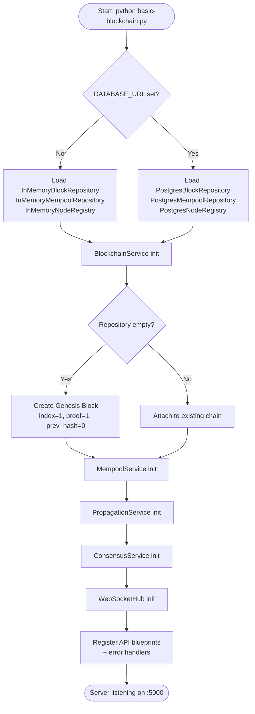
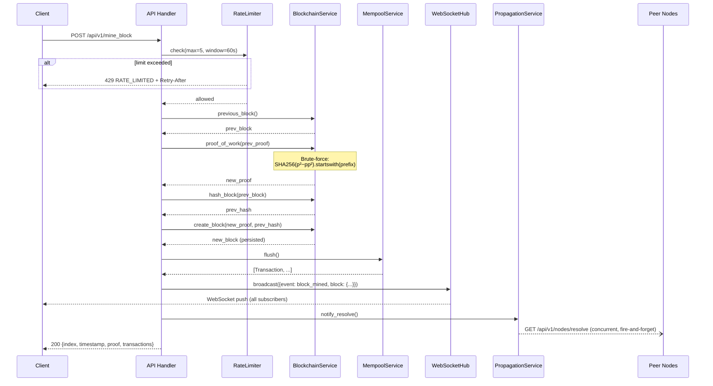
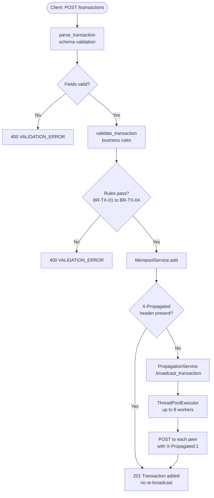
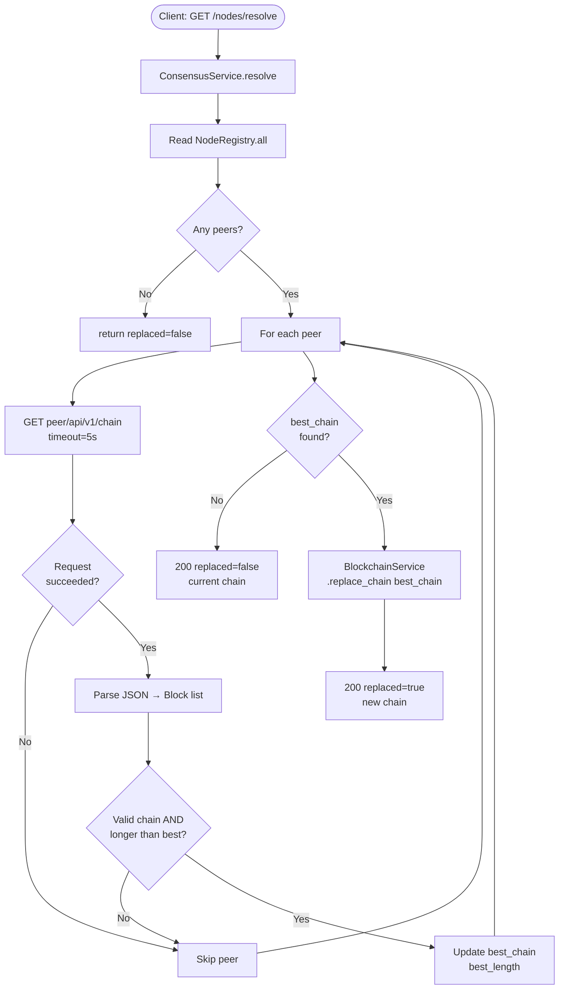
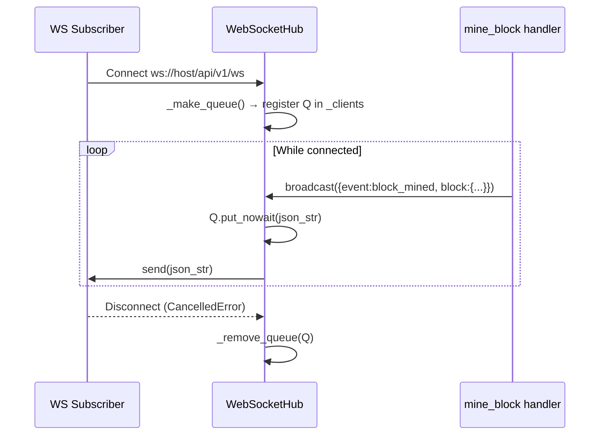
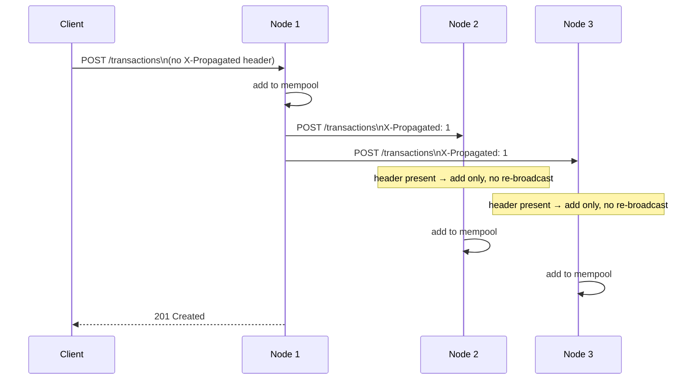
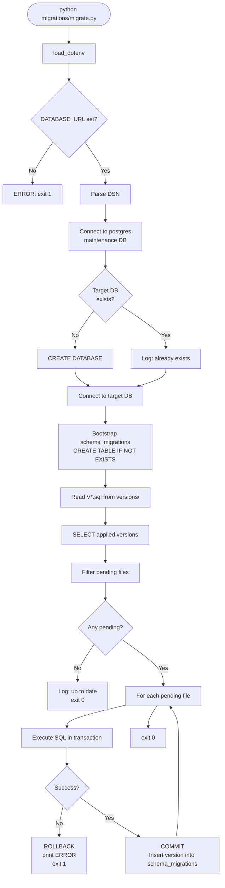
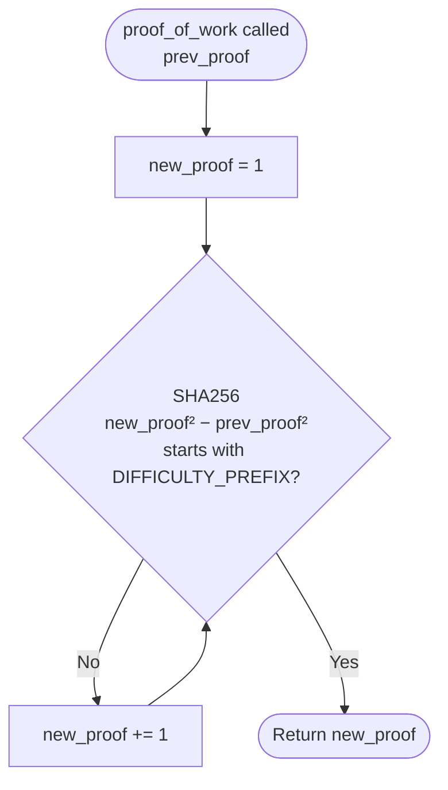
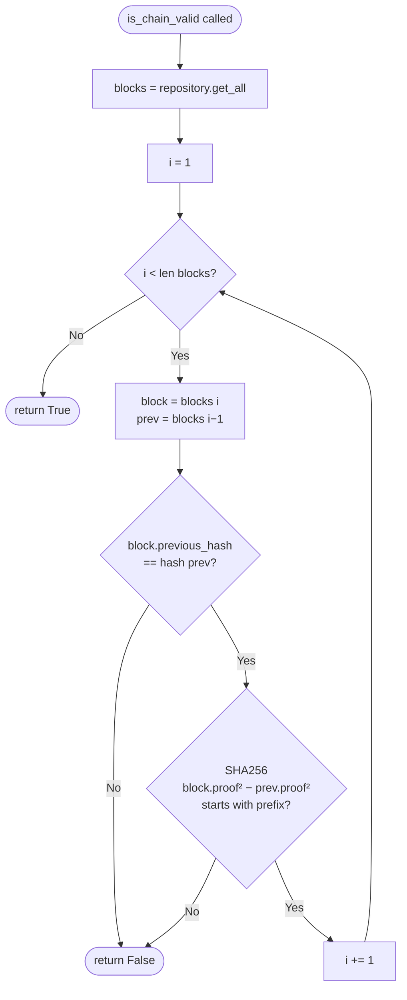
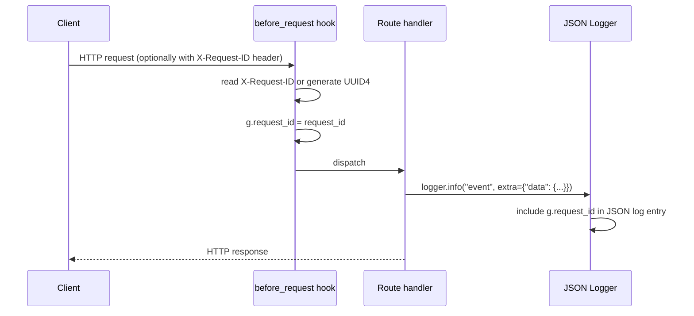

# Flow Diagrams — Blockchain Simulator

All diagrams use [Mermaid](https://mermaid.js.org/) syntax.

---

## 1. Application Startup Flow

---

## 2. Mining Flow (POST /api/v1/mine_block)

---

## 3. Transaction Submission Flow (POST /api/v1/transactions)

---

## 4. Consensus Resolution Flow (GET /api/v1/nodes/resolve)

---

## 5. WebSocket Event Flow

---

## 6. Transaction Propagation Loop Prevention

---

## 7. Database Migration Flow (python migrations/migrate.py)

---

## 8. Proof-of-Work Algorithm

---

## 9. Chain Validation Algorithm

---

## 10. Request ID Lifecycle

