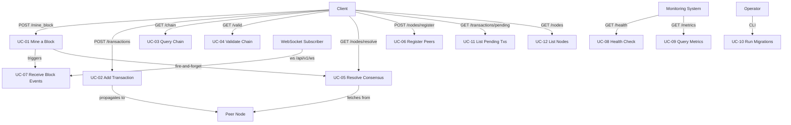

# Use Cases — Blockchain Simulator

## Actors

| Actor | Description |
|-------|-------------|
| **Client** | Any HTTP client (curl, Postman, browser, peer node) that calls the REST API. |
| **Peer Node** | Another running instance of this simulator registered via `/nodes/register`. |
| **WebSocket Subscriber** | A client holding an open connection to `/api/v1/ws`. |
| **Operator** | The person responsible for deploying and configuring the node (runs `migrate.py`, sets env vars). |
| **System (Scheduler)** | Automated background process; not present in this version. |

---

## UC-01 — Mine a Block

**Primary actor:** Client  
**Preconditions:** Server is running. There may be zero or more pending transactions in the mempool.  
**Trigger:** `POST /api/v1/mine_block`

**Main flow:**
1. Client sends `POST /api/v1/mine_block`.
2. System checks the rate limit (≤ 5 requests / 60 s). If exceeded → UC-01a.
3. System reads the previous block from the repository.
4. System executes Proof-of-Work: iterates candidate proofs until `SHA256(proof² − prev_proof²)` starts with `DIFFICULTY_PREFIX`.
5. System hashes the previous block.
6. System creates a new `Block` and persists it.
7. System flushes all pending `Transaction` objects from the mempool and associates them with the new block.
8. System broadcasts `{"event": "block_mined", "block": {...}}` to all WebSocket subscribers (UC-07).
9. System triggers consensus resolution on all registered peers (UC-05, fire-and-forget).
10. System returns HTTP 200 with block data and included transactions.

**Alternate flow UC-01a — Rate limit exceeded:**
- System returns HTTP 429 with `{"error": "...", "code": "RATE_LIMITED", "retry_after_seconds": N}` and header `Retry-After: N`.

**Postconditions:** Chain length increased by 1. Mempool is empty. All peers will run consensus within their timeout window.

---

## UC-02 — Add a Transaction

**Primary actor:** Client  
**Preconditions:** Server is running.  
**Trigger:** `POST /api/v1/transactions` with JSON body `{sender, receiver, amount}`.

**Main flow:**
1. Client sends transaction payload.
2. System validates schema: all three fields present; `amount` is numeric. On failure → UC-02a.
3. System validates business rules (BR-TX-01 to BR-TX-04). On failure → UC-02a.
4. System appends `Transaction` to the mempool.
5. If the request does **not** carry `X-Propagated: 1` header:
   - System broadcasts transaction to all registered peers concurrently (up to 8 workers).
   - Each peer request carries `X-Propagated: 1` to prevent loops (BR-TX-08).
6. System returns HTTP 201 with the transaction data.

**Alternate flow UC-02a — Validation failure:**
- System returns HTTP 400 with `{"error": "<reason>", "code": "VALIDATION_ERROR"}`.

**Postconditions:** Transaction is pending in the mempool (locally and on all reachable peers).

---

## UC-03 — Query the Chain

**Primary actor:** Client  
**Trigger:** `GET /api/v1/chain`

**Main flow:**
1. Client requests the full chain.
2. System reads all blocks from the repository in ascending index order.
3. System returns HTTP 200 with `{"chain": [...], "length": N}`.

**Postconditions:** No state change. Client receives current chain snapshot.

---

## UC-04 — Validate Chain Integrity

**Primary actor:** Client  
**Trigger:** `GET /api/v1/valid`

**Main flow:**
1. Client requests chain validation.
2. System reads the full chain and iterates from block 2 onward.
3. For each block: verifies `proof_of_work` condition and `previous_hash` linkage.
4. Returns HTTP 200 with `{"valid": true|false, "message": "..."}`.

**Postconditions:** No state change.

---

## UC-05 — Resolve Consensus (Longest-Chain Rule)

**Primary actor:** Client or Peer Node (via fire-and-forget after mining)  
**Trigger:** `GET /api/v1/nodes/resolve`

**Main flow:**
1. System iterates registered peers.
2. For each peer: `GET {peer}/api/v1/chain` with a 5-second timeout.
3. System parses the remote chain into `Block` objects and validates it.
4. System tracks the longest valid remote chain found.
5. If the best remote chain is strictly longer than the local chain:
   - System replaces the local chain via `BlockchainService.replace_chain()`.
   - Returns HTTP 200 with `{"replaced": true, "chain": [...]}`.
6. Otherwise returns HTTP 200 with `{"replaced": false, "chain": [...]}`.

**Alternate flows:**
- Peer is unreachable → skipped silently.
- Peer returns invalid chain → skipped silently.

**Postconditions:** Local chain is the longest valid chain known at the time of resolution.

---

## UC-06 — Register Peer Nodes

**Primary actor:** Operator or Client  
**Trigger:** `POST /api/v1/nodes/register` with JSON `{"nodes": ["url1", "url2", ...]}`

**Main flow:**
1. Client provides one or more node URLs.
2. System validates list is non-empty (BR-ND-04). On failure → UC-06a.
3. For each URL: system normalises (add `http://` scheme if missing, strip path/query) and deduplicates.
4. System persists URLs to the node registry.
5. Returns HTTP 201 with updated node list and total count.

**Alternate flow UC-06a — Empty list:**
- Returns HTTP 400 with `{"error": "...", "code": "VALIDATION_ERROR"}`.

**Postconditions:** New peers are registered and available for propagation and consensus.

---

## UC-07 — Receive Real-Time Block Events (WebSocket)

**Primary actor:** WebSocket Subscriber  
**Trigger:** `GET /api/v1/ws` upgrade to WebSocket.

**Main flow:**
1. Client connects to `ws://host/api/v1/ws`.
2. System creates a dedicated asyncio queue for the client and registers it in `WebSocketHub`.
3. System enters a send loop: reads messages from the queue and forwards them to the client.
4. When any node mines a block (UC-01, step 8), the system places `{"event": "block_mined", "block": {...}}` on all registered queues.
5. Client receives the JSON message immediately.
6. On client disconnect: queue is removed; no further messages sent.

**Postconditions:** Client is notified of every block mined while connected.

---

## UC-08 — Check Node Health

**Primary actor:** Client / Monitoring system  
**Trigger:** `GET /api/v1/health`

**Main flow:**
1. System reads current chain height.
2. If a `DATABASE_URL` is configured, system attempts a `SELECT 1` connectivity check (3-second timeout).
3. Returns HTTP 200 with `{"status": "ok", "db": "ok"|"n/a", "chain_height": N}`.

**Alternate flow — DB unreachable:**
- Returns HTTP 503 with `{"status": "degraded", "db": "error", "chain_height": N}`.

---

## UC-09 — Query Metrics

**Primary actor:** Client / Monitoring system  
**Trigger:** `GET /api/v1/metrics`

**Main flow:**
1. System reads `chain_height`, `pending_transactions` count, and computes `avg_mine_time_seconds` (null if < 2 blocks).
2. Returns HTTP 200 with the metrics object.

---

## UC-10 — Run Database Migrations

**Primary actor:** Operator  
**Trigger:** `python migrations/migrate.py` (CLI)

**Preconditions:** `DATABASE_URL` is set in the environment or in `.env`.

**Main flow:**
1. Script loads `.env` via `python-dotenv`.
2. Validates `DATABASE_URL` is present; exits with error if not.
3. Parses DSN; connects to `postgres` maintenance database and creates the target database if it does not exist.
4. Connects to the target database and bootstraps `schema_migrations` table.
5. Reads all `V*.sql` files from `migrations/versions/` in lexicographic order.
6. Skips versions already recorded in `schema_migrations`.
7. Applies each pending migration in its own transaction; records its version on success.
8. Exits 0 on success, 1 on any error.

**Postconditions:** Target database schema is up to date.

---

## UC-11 — List Pending Transactions

**Primary actor:** Client  
**Trigger:** `GET /api/v1/transactions/pending`

**Main flow:**
1. System reads all pending transactions from the mempool (non-destructive).
2. Returns HTTP 200 with `{"transactions": [...], "count": N}`.

---

## UC-12 — List Registered Nodes

**Primary actor:** Client  
**Trigger:** `GET /api/v1/nodes`

**Main flow:**
1. System reads all registered node URLs from the registry.
2. Returns HTTP 200 with `{"nodes": [...], "total": N}`.

---

## Use Case Relationship Diagram

